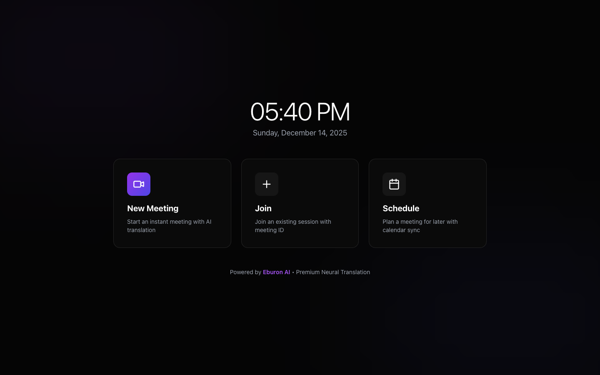
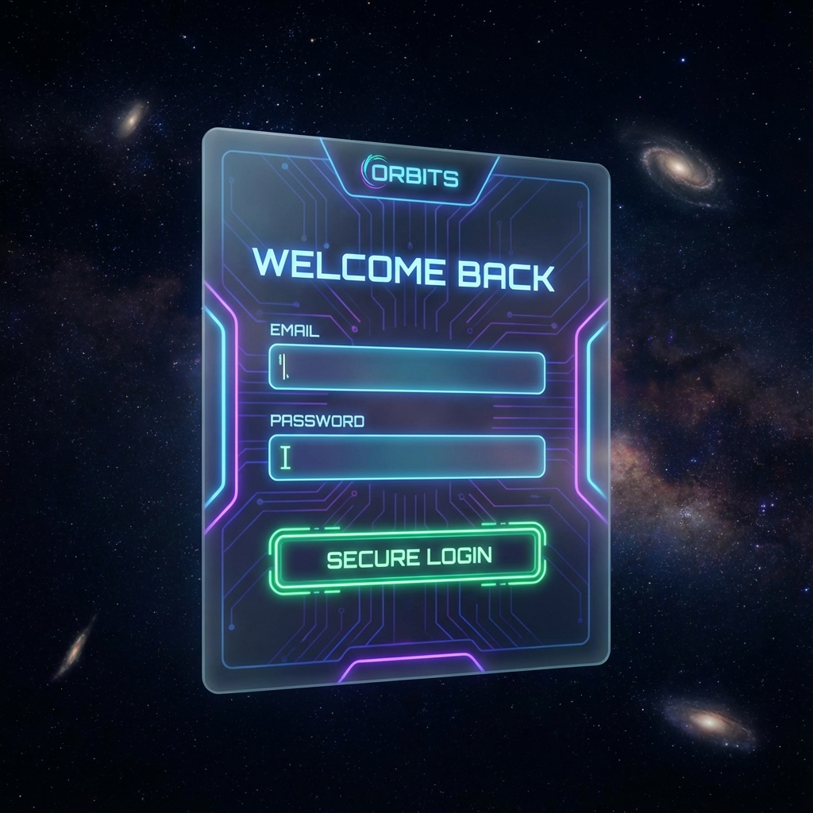
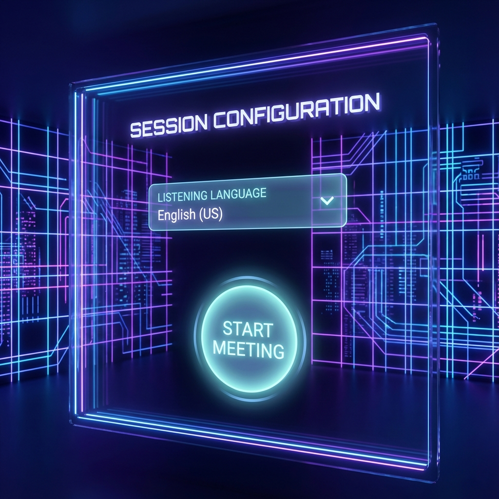
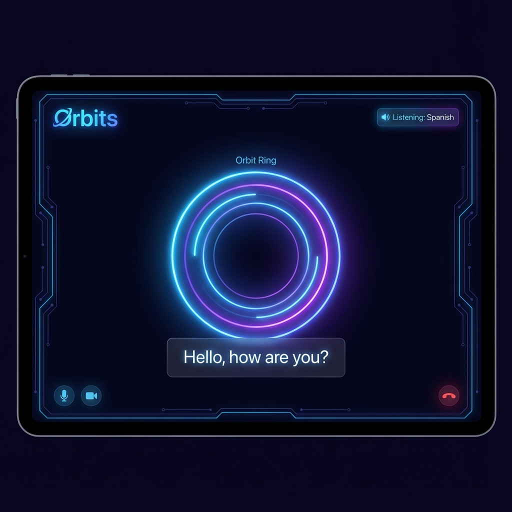

# Orbits: Nuance Translation Engine

<div align="center">
  
  <h1>ORBITS AI</h1>
  <p><strong>Real-Time Voice Translation with "Extreme Nuance"</strong></p>
  <p>
    <a href="ORBITS.md"><strong>Explore Architecture & Design (ORBITS.md)</strong></a> | 
    <a href="task.md"><strong>View Dev Log (task.md)</strong></a>
  </p>
</div>

---

## 🌌 Overview
Orbits is a futuristic real-time translation app designed to preserve the human element of speech. It doesn't just translate words; it captures **verbatim disfluency** (stutters, filler words) using **Deepgram Nova-3** and **Gemini Flash 2.5**, and speaks them back with strictly sequenced, low-latency audio via **Gemini Streaming TTS**.

## 📸 App Interface

### 1. The Portal (Landing)
A futuristic entry point into the Orbits neural network.


### 2. Secure Handshake (Auth)
Glassmorphism-styled authentication to save your neural profile.


### 3. Session Configuration
Simple setup: Just tell proper "Listening Language". We handle the rest.


### 4. Neural Link (Active Call)
The core interface featuring the **Orbit Ring** visualizer and floating, icon-coded subtitles.


---

## 🚀 Getting Started

### Prerequisites
- Node.js 18+
- Keys for **Gemini** and **Deepgram**.

### Installation

1. **Clone & Install**
   ```bash
   git clone https://github.com/your-username/orbits.git
   cd orbits
   npm install
   ```

2. **Configure Environment**
   Create `.env.local` and add your keys:
   ```env
   VITE_GEMINI_API_KEY=your_gemini_key
   VITE_DEEPGRAM_API_KEY=your_deepgram_key
   VITE_SUPABASE_URL=your_supabase_url
   VITE_SUPABASE_ANON_KEY=your_supabase_key
   ```

3. **Ignite the Engine**
   ```bash
   npm run dev
   ```

## 📚 Documentation
For deep dives into the **Audio Pipeline**, **Database Schema**, and **System Prompts**, refer to the core documentation:

👉 **[ORBITS.md](./ORBITS.md)**

## 🛠 Development Log
Track our journey and remaining tasks:

👉 **[task.md](./task.md)**
